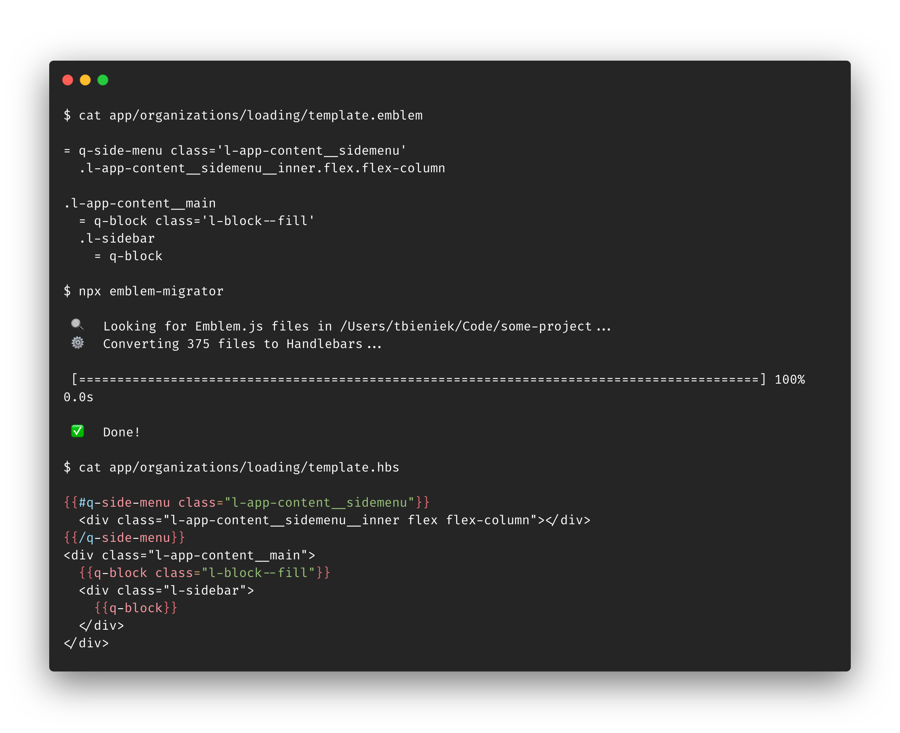

emblem-migrator
==============================================================================

Migrate Emblem.js to pretty Handlebars files



Usage
------------------------------------------------------------------------------

```bash
npx emblem-migrator [PATH]
```

Running the above command will automatically download the migrator from [npm](https://www.npmjs.com/)
and run it for all Emblem.js files in the current folder and any subfolders.
If you pass a different path it will look for all Emblem.js files in that
folder and its subfolders. `PATH` can also be the path to a single file.


Known Issues
------------------------------------------------------------------------------

- Due to the way the Emblem.js parser works we can't convert Emblem.js comments
  to Handlebars comments. The comments will be ignored by the parser and do not
  show up in the resulting Handlebars template.


Related
------------------------------------------------------------------------------

- [Emblem.js](http://emblemjs.com/) – a concise, beautiful, and fully
  compatible templating alternative for Handlebars.js
- [prettier](https://github.com/chaijs/chai-jquery) – An opinionated code
  formatter


License
------------------------------------------------------------------------------

emblem-migrator is developed by and &copy; [Mainmatter GmbH](http://mainmatter.com) and
contributors. It is released under the [MIT License](https://github.com/simplabs/emblem-migrator/blob/master/LICENSE.md).
